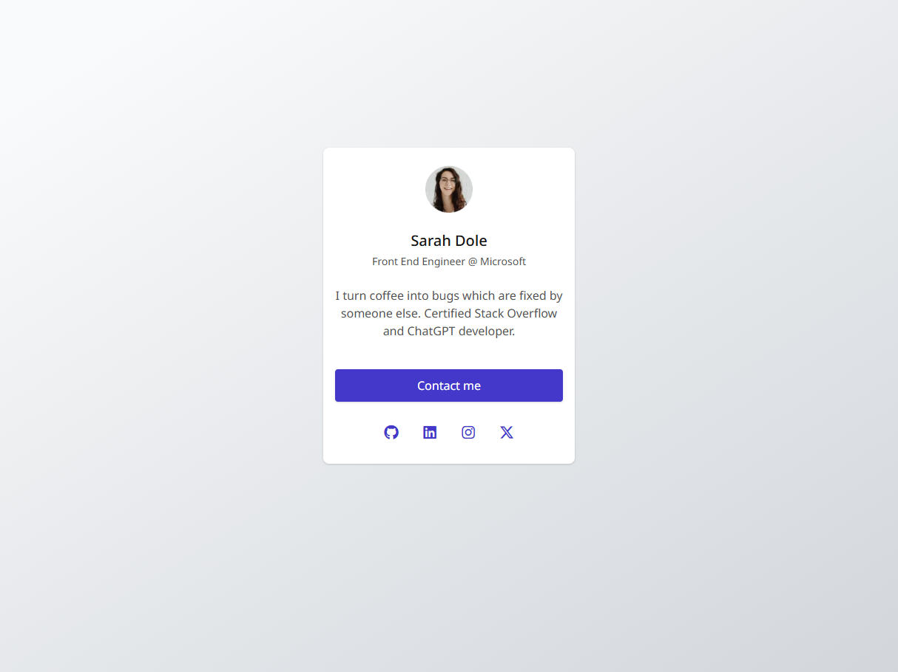

# Profile Card

This is the solution for the **Profile Card** project from [GreatFrontEnd](https://www.greatfrontend.com/projects).  
The goal of this project is to build a profile card component using semantic HTML and CSS, following the provided style guide.

---

## 📸 Preview

---

## 📌 Features

- Semantic HTML structure (`article`, `header`, `footer`).
- Accessible markup with `aria-labels`, `alt` text and focus states.
- Optimized avatar image using **WebP** with PNG fallback.
- Responsive and centered layout with Flexbox.
- BEM methodology for class naming.
- Utility classes for common flex patterns.

---

## 🛠️ Built with

- HTML5
- CSS3 (BEM + utility classes)
- [Font Awesome](https://fontawesome.com/) for social media icons
- [Google Fonts](https://fonts.google.com/) – Noto Sans

---

## 🚀 Live Demo

- **Repository**: [GitHub Repo](https://github.com/abilioassis/gfe-profile-card)
- **Live Preview**: [GitHub Pages](https://abilioassis.github.io/gfe-profile-card/)

---

## 👤 Author

- Built by [Abilio de Assis](https://www.greatfrontend.com/projects/u/abiliodeassis)
